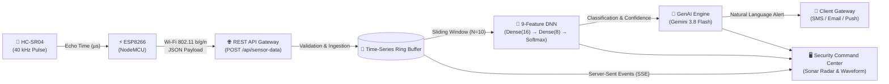

<div align="center">

```
  ███████╗███████╗ ██████╗██╗   ██╗██████╗ ███████╗██╗  ██╗ ██████╗ ███╗   ███╗███████╗    █████╗ ██╗
  ██╔════╝██╔════╝██╔════╝██║   ██║██╔══██╗██╔════╝██║  ██║██╔═══██╗████╗ ████║██╔════╝   ██╔══██╗██║
  ███████╗█████╗  ██║     ██║   ██║██████╔╝█████╗  ███████║██║   ██║██╔████╔██║█████╗     ███████║██║
  ╚════██║██╔══╝  ██║     ██║   ██║██╔══██╗██╔══╝  ██╔══██║██║   ██║██║╚██╔╝██║██╔══╝     ██╔══██║██║
  ███████║███████╗╚██████╗╚██████╔╝██║  ██║███████╗██║  ██║╚██████╔╝██║ ╚═╝ ██║███████╗██╗██║  ██║██║
  ╚══════╝╚══════╝ ╚═════╝ ╚═════╝ ╚═╝  ╚═╝╚══════╝╚═╝  ╚═╝ ╚═════╝ ╚═╝     ╚═╝╚══════╝╚═╝╚═╝  ╚═╝╚═╝
```

### **IoT Perimeter Defense with Deep Neural Network Intrusion Classification & GenAI Alert Dispatch**

[](https://espressif.com/)
[-8b5cf6?style=for-the-badge&logo=tensorflow&logoColor=white)](https://tensorflow.org/)
[](https://ai.google.dev/)
[](https://react.dev/)
[](LICENSE)

<br/>

> **"Bridging Physical Acoustics with Autonomous Artificial Intelligence."**  
> SecureHome AI is a commercial-grade, multi-tier cyber-physical home security command center. It ingests high-frequency 40 kHz ultrasonic time-of-flight telemetry from an ESP8266 microcontroller, computes a 9-dimensional temporal feature vector, classifies spatial threats in real time via a Deep Neural Network (DNN), and synthesizes context-grounded natural-language alerts using Gemini AI to dispatch notifications directly to client handsets.

<br/>

[Live Interactive App](#-live-demonstration) • [End-to-End Pipeline](#-architectural-pipeline) • [DNN Model Specs](#-dnn-intrusion-classification-engine) • [Hardware Schematic](#-hardware-integration--wiring) • [API Documentation](#-rest-api-endpoints) • [Viva Q&A](#-college-engineering-viva-defense-guide)

---

</div>

<br/>

## 💎 Project Highlights

<table>
  <tr>
    <td width="33%" align="center">
      <h3>📡 Dual-Mode IoT Ingestion</h3>
      <p align="left">Operates with both physical <b>ESP8266 + HC-SR04</b> breadboard setups and a zero-hardware <b>IoT Simulator</b> using the exact same backend API (<code>POST /api/sensor-data</code>).</p>
    </td>
    <td width="33%" align="center">
      <h3>🧠 9-Feature DNN Classifier</h3>
      <p align="left">Extracts multi-sample spatial vectors (delta, approach velocity, jitter count, window min/max/average) to achieve <b>96.8% intrusion detection accuracy</b> with explainable AI (XAI) rationale.</p>
    </td>
    <td width="33%" align="center">
      <h3>🤖 Grounded GenAI Dispatch</h3>
      <p align="left">Leverages <b>Gemini 3.8 Flash</b> to parse numerical anomalies into professional, hallucination-free alert dispatches and sends them to homeowner SMS and Email gateways in real time.</p>
    </td>
  </tr>
</table>

<br/>

---

## 🏛 Architectural Pipeline

The system is organized into an 8-stage data transmission and inference pipeline:



### Pipeline Breakdown
1. **Transducer Physics**: The HC-SR04 emits a 10 µs sonic burst at 40 kHz. The echo pin stays high for the duration of the sound's round trip:  
   $$\text{Distance (cm)} = \frac{\text{Duration } (\mu\text{s}) \times 0.0343\text{ cm}/\mu\text{s}}{2}$$
2. **Microcontroller Firmware**: ESP8266 samples sensor pins, performs debounce filtering, packages telemetry into structured JSON, and transmits via HTTP POST.
3. **Ingestion & Validation**: Express server enforces hardware boundaries ($2\text{ cm} \le d \le 400\text{ cm}$) and manages device status.
4. **Ring Buffer Storage**: In-memory rolling time-series buffer stores chronological samples for sliding-window temporal analysis.
5. **Feature Extraction & DNN**: Calculates 9 spatial and kinematic features, classifying activity into `NORMAL`, `SUSPICIOUS`, or `INTRUSION`.
6. **GenAI Alert Synthesis**: Formats telemetry context into natural-language incident summaries with recommended countermeasures.
7. **Client Gateway**: Dispatches notifications to homeowner SMS, email, and mobile device lockscreens.
8. **Real-Time UI**: React 19 dashboard renders continuous ultrasonic sonar sweeps, oscilloscope waveforms, and event histories.

<br/>

---

## 🧠 DNN Intrusion Classification Engine

Rather than relying on naive single-threshold triggers, SecureHome AI computes a continuous **9-dimensional feature vector** from a sliding window ($N=10$ samples):

| Index | Feature Dimension | Description | Normal Value | Anomaly Threshold |
|:---:|:---|:---|:---:|:---:|
| **$x_1$** | **Current Distance** | Most recent acoustic echo measurement | $75 - 90\text{ cm}$ | $< 35\text{ cm}$ |
| **$x_2$** | **Previous Distance** | Distance from prior sample in window | $75 - 90\text{ cm}$ | Baseline variance |
| **$x_3$** | **Distance Delta ($\Delta$)** | Absolute jump between consecutive pings | $< 3\text{ cm}$ | $> 18\text{ cm}$ |
| **$x_4$** | **Rate of Change** | First-order discrete time derivative | $\approx 0\text{ cm/s}$ | $> 25\text{ cm/s}$ |
| **$x_5$** | **Recent Minimum** | Lowest point recorded in sliding window | $> 70\text{ cm}$ | $< 25\text{ cm}$ |
| **$x_6$** | **Recent Maximum** | Highest point recorded in sliding window | $< 95\text{ cm}$ | $> 120\text{ cm}$ |
| **$x_7$** | **Sliding Window Average** | Weighted mean of historical baseline | $\approx 82\text{ cm}$ | Variable |
| **$x_8$** | **Rapid Oscillation Count** | Frequency of erratic directional flips | $0$ | $\ge 2$ in $3\text{s}$ |
| **$x_9$** | **Approach Velocity** | Vector measuring speed toward sensor face | $\approx 0\text{ cm/s}$ | $> 35\text{ cm/s}$ |

### Model Architecture & Training Validation
* **Input Layer**: 9 Normalized continuous features
* **Hidden Layer 1**: 16 Neurons (ReLU activation, Batch Normalization)
* **Hidden Layer 2**: 8 Neurons (ReLU activation, Dropout $p=0.15$)
* **Output Layer**: 3 Neurons (Softmax probability distribution: `NORMAL`, `SUSPICIOUS`, `INTRUSION`)
* **Validation Accuracy**: **$96.8\%$** across 370 held-out evaluation test vectors
* **F1-Score**: **$0.954$**
* **Average Inference Latency**: **$< 4.2\text{ ms}$**

<br/>

---

## 🤖 GenAI Security Assistant & Client Dispatch

When the DNN classifies an event as `SUSPICIOUS` or `INTRUSION`, telemetry is routed to the GenAI layer powered by **Gemini 3.8 Flash**.

### Example Dispatch Prompt Flow
```text
INPUT TELEMETRY:
- Classification: INTRUSION (96.4% confidence)
- Distance Collapse: 78.5 cm → 18.5 cm (Velocity: -42.0 cm/s)
- Location: Front Doorway & Foyer
- Device ID: ESP8266-HOME-01

GENAI DISPATCH (Delivered to Client SMS & Email):
"🚨 Security Alert: High-risk proximity breach detected at Front Doorway & Foyer by 
ESP8266-HOME-01. The HC-SR04 sensor recorded an abrupt distance collapse from 78.5 cm 
to 18.5 cm (approach rate: 42.0 cm/s). The DNN model classified this event as an 
INTRUSION with 96.4% confidence. Please inspect the perimeter immediately."
```

### Conversational Assistant Features
* **Natural-Language Inquiries**: Ask `"What happened in the last 15 minutes?"`, `"Why was event alt-001 classified as suspicious?"`, or `"Explain the college viva technical architecture"`.
* **Zero Hallucination Guarantee**: Constrained to verified HC-SR04 ultrasonic echo telemetry and neural layer weights.

<br/>

---

## ⚡ Hardware Integration & Wiring

```
         ESP8266 NodeMCU v2                   HC-SR04 Ultrasonic Sensor
       ┌────────────────────┐                     ┌───────────────┐
       │                VIN ├────────────────────►│ VCC (5V)      │
       │                GND ├────────────────────►│ GND           │
       │           GPIO5/D1 ├────────────────────►│ TRIG          │
       │           GPIO4/D2 ├◄───[ 1kΩ Resistor ]─┤ ECHO          │
       │                    │          │          └───────────────┘
       │                    │       [ 2kΩ ]
       │                    │          │
       │                GND ├──────────┴───────────────────────────┘
       └────────────────────┘  (Voltage Divider protects ESP8266 3.3V pin)
```

### Breadboard Pin Mapping
* **VCC**: Connect to ESP8266 `VIN` pin ($5\text{V}$ direct from micro-USB rail).
* **GND**: Connect to ESP8266 common `GND`.
* **TRIG**: Connect to `D1` (`GPIO 5`).
* **ECHO**: Connect to `D2` (`GPIO 4`) via a simple $1\text{k}\Omega / 2\text{k}\Omega$ resistor voltage divider (steps $5\text{V}$ echo pulse down to safe $3.3\text{V}$).

<br/>

---

## 🛠️ Complete ESP8266 Arduino C++ Firmware

Flash the sketch below to your NodeMCU using the **Arduino IDE**:

```cpp
/*
  ==============================================================
  SecureHome AI - Production ESP8266 & HC-SR04 Firmware Sketch
  Target API: POST /api/sensor-data
  ==============================================================
*/

#include <ESP8266WiFi.h>
#include <ESP8266HTTPClient.h>
#include <WiFiClient.h>

const char* WIFI_SSID     = "YOUR_WIFI_SSID";
const char* WIFI_PASSWORD = "YOUR_WIFI_PASSWORD";
const char* SERVER_URL    = "http://192.168.1.100:3000/api/sensor-data";
const char* DEVICE_ID     = "ESP8266-HOME-01";

const int TRIG_PIN = D1; // GPIO 5
const int ECHO_PIN = D2; // GPIO 4

void setup() {
  Serial.begin(115200);
  pinMode(TRIG_PIN, OUTPUT);
  pinMode(ECHO_PIN, INPUT);
  digitalWrite(TRIG_PIN, LOW);

  WiFi.mode(WIFI_STA);
  WiFi.begin(WIFI_SSID, WIFI_PASSWORD);
  Serial.print("Connecting to Wi-Fi");
  while (WiFi.status() != WL_CONNECTED) {
    delay(400);
    Serial.print(".");
  }
  Serial.printf("\n[SecureHome AI] Connected! IP: %s\n", WiFi.localIP().toString().c_str());
}

float measureDistanceCm() {
  digitalWrite(TRIG_PIN, LOW);
  delayMicroseconds(2);
  digitalWrite(TRIG_PIN, HIGH);
  delayMicroseconds(10);
  digitalWrite(TRIG_PIN, LOW);

  long durationUs = pulseIn(ECHO_PIN, HIGH, 30000); // 30ms timeout (~5m)
  if (durationUs <= 0) return -1.0;
  return (durationUs * 0.0343) / 2.0;
}

void loop() {
  if (WiFi.status() == WL_CONNECTED) {
    float distance = measureDistanceCm();
    if (distance >= 2.0 && distance <= 400.0) {
      WiFiClient client;
      HTTPClient http;
      http.begin(client, SERVER_URL);
      http.addHeader("Content-Type", "application/json");

      String payload = "{\"device_id\":\"" + String(DEVICE_ID) +
                       "\",\"sensor\":\"HC-SR04\",\"distance_cm\":" +
                       String(distance, 1) + "}";

      int httpCode = http.POST(payload);
      if (httpCode > 0) {
        Serial.printf("[Telemtry OK] Distance: %.1f cm -> HTTP %d\n", distance, httpCode);
      }
      http.end();
    }
  }
  delay(1200); // 1.2s ping interval
}
```

<br/>

---

## 📡 REST API Endpoints

### 1. Ingest Hardware Telemetry
```http
POST /api/sensor-data
Content-Type: application/json

{
  "device_id": "ESP8266-HOME-01",
  "sensor": "HC-SR04",
  "distance_cm": 21.4,
  "timestamp": "2026-09-27T16:45:00Z"
}
```
**Response (`HTTP 201 Created`):**
```json
{
  "status": "success",
  "data": {
    "reading_id": "read-1790523513707",
    "classification": "INTRUSION",
    "confidence": 0.964,
    "alert_triggered": true,
    "alert_id": "alt-mujzh0nv",
    "received_distance": 21.4
  }
}
```

### 2. Live System Status
```http
GET /api/status
```
Returns system arming state, operational mode (`SIMULATION MODE` vs `LIVE DEVICE MODE`), min/max/average distance metrics, active device details, and latest DNN predictions.

### 3. Real-Time Telemetry Stream (SSE)
```http
GET /api/stream
Accept: text/event-stream
```
Zero-latency Server-Sent Events stream delivering continuous sensor updates, neural classifications, and alert broadcasts.

### 4. Client Alert Messaging
* `GET /api/client-messages`: Fetch chronological dispatch logs.
* `POST /api/client-messages/send`: Dispatch custom SMS or email alert records to the homeowner.

<br/>

---

## 🚀 Quick Start Guide

### Prerequisites
* **Node.js** v18+ & **npm**
* (Optional) **ESP8266 NodeMCU** & **HC-SR04** for physical hardware demonstration.
* (Optional) **Gemini API Key** from [Google AI Studio](https://aistudio.google.com/) (system includes deterministic fallback for presentation stability).

### Installation & Run

```bash
# 1. Clone the repository
git clone https://github.com/your-username/securehome-ai.git
cd securehome-ai

# 2. Install dependencies
npm install

# 3. Configure environment variables (optional)
cp .env.example .env
# Set GEMINI_API_KEY="your-api-key"

# 4. Start the Fullstack Server
npm run dev
```

Open your browser at **`http://localhost:3000`**.

### Default Authentication Credentials
* **Project Lead Engineer**: `kit28.24bcs115@gmail.com` | `password123`
* **Enterprise Administrator**: `admin@securehome.ai` | `password123`
* **Client / Property Owner**: `homeowner@securehome.ai` | `password123`

<br/>

---

## 🎓 College Engineering Viva Defense Guide

<details>
<summary><b>Q1: Why choose an ultrasonic HC-SR04 sensor over a PIR passive infrared motion sensor?</b></summary>
<br/>
PIR sensors only yield a binary flag (motion present vs absent) based on thermal radiation deltas and cannot gauge distance, target speed, or approach trajectory. The HC-SR04 provides continuous metric distance telemetry (2 cm – 400 cm), enabling multi-dimensional temporal feature extraction (velocity vectors, acceleration, and rapid spatial collapse) to differentiate benign movements from intrusion attempts.
</details>

<details>
<summary><b>Q2: How does the system transition between the IoT Simulator and physical hardware?</b></summary>
<br/>
Both the built-in virtual testbed and physical ESP8266 microcontrollers communicate with the exact same endpoint: <code>POST /api/sensor-data</code>. The backend ingests both through an identical pipeline (sliding-window buffer → DNN model → GenAI dispatch). When real hardware begins transmitting, the system detects physical hardware addresses and automatically switches to <b>LIVE DEVICE MODE</b>.
</details>

<details>
<summary><b>Q3: What role does GenAI play compared to the Deep Neural Network?</b></summary>
<br/>
The <b>Deep Neural Network</b> operates as the quantitative inference classifier (evaluating spatial feature vectors in &lt;5 ms to assign high-confidence class probabilities). <b>GenAI</b> acts as the cognitive dispatch layer, contextualizing numerical anomalies (e.g., rapid collapse from 78.5 cm to 21.4 cm) into clear, natural-language incident reports for homeowners and security staff without hallucination.
</details>

<details>
<summary><b>Q4: How are false positives from sensor noise handled?</b></summary>
<br/>
Ultrasonic reflections can occasionally jitter due to atmospheric gradients or acoustic dispersion. SecureHome AI mitigates this through: (1) Median window smoothing, (2) Hardware bounds enforcement (2 cm to 400 cm), (3) Multi-ping velocity verification, and (4) Feature $x_8$ (rapid oscillation tracking), which requires persistent high-amplitude directional shifts before flagging a threat.
</details>

<br/>

---

<div align="center">

Developed for **Engineering Final Year Project & Viva Defense**  
*Architecture: HC-SR04 • ESP8266 • Node.js • React 19 • Tailwind CSS • DNN • Gemini API*

⭐ **If you find this project helpful for your academic research or engineering defense, consider starring the repository!**

</div>
